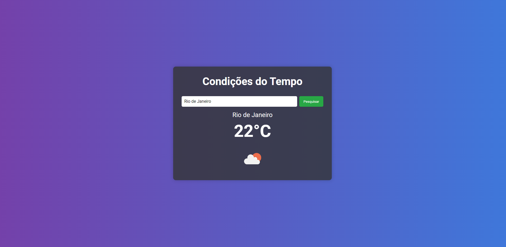

# Condições do Tempo 🌤️

Este é um projeto de previsão do tempo utilizando TypeScript e a API OpenWeatherMap. A aplicação permite ao usuário pesquisar informações meteorológicas sobre qualquer local no mundo.

## Demonstração 📸

## Funcionalidades ✨

- Pesquisar a previsão do tempo para qualquer localização.
- Exibir temperatura atual, nome do local e um ícone representando as condições meteorológicas.
- Interface moderna e responsiva.

## Tecnologias Utilizadas 🛠️

- **TypeScript**: Linguagem de programação que adiciona tipagem estática ao JavaScript.
- **OpenWeatherMap API**: API que fornece dados meteorológicos.
- **HTML5**: Estrutura do conteúdo web.
- **CSS3**: Estilos modernos para a aplicação.
- **JavaScript**: Manipulação dinâmica dos elementos da página.